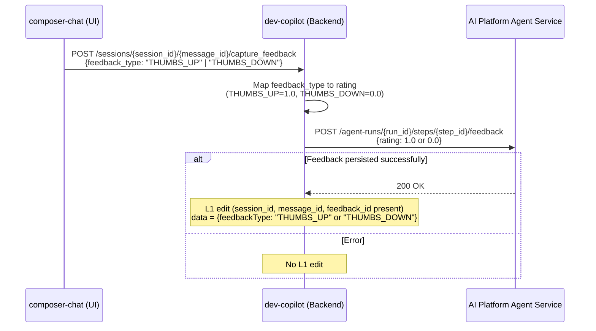
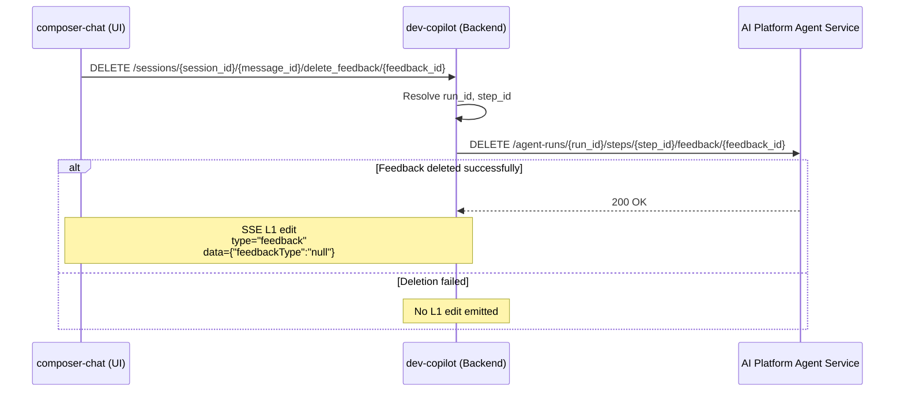

# Feature Specification: Feedback Capture on Agent Messages

Created: 2026-06-16
Status: Draft  
Components: developer-copilot (backend), composer-chat (frontend), ai-platform-agents (AIP)

---

## Overview

Enable users to submit thumbs-up/thumbs-down feedback on individual assistant messages in the Developer Copilot chat UI. Feedback is stored in AI Platform's tracing infrastructure (via the feedback store), scoped to individual steps within an agent run. On session reload, previously submitted feedback is displayed alongside the corresponding messages.

**Key Problem:** There is no mechanism to capture user satisfaction signals on individual LLM responses. This data is critical for evaluating agent quality, identifying failure patterns, and improving prompt engineering.

**Solution:** Create dedicated endpoints for capture_feedback, delete, and change feedback operations. Expose `run_id` and `step_id` in SSE envelopes so the UI can submit feedback per message. On GET events, stream feedback state as L1 edit events to the UI.

---

## System Components

| Component | Responsibility |
|-----------|---------------|
| composer-chat (UI) | Render thumbs up/down buttons on assistant messages, submit feedback via API |
| @appian/ui-library | UnifiedChat component — may need onFeedback callback or already exposes one |
| developer-copilot (backend) | Route feedback to AIP, stream feedback state via SSE |
| AI Platform Agents API | Store/retrieve feedback annotations per step within a run |
| AI Platform Feedback Store | Persistent storage (PostgreSQL agent_feedback table) |

---

## Architecture Diagram

### Capture Feedback



### Delete Feedback



### Change Feedback

```mermaid
<!-- Mermaid code for Change Feedback flow -->
```
sequenceDiagram
    participant UI as composer-chat (UI)
    participant BE as dev-copilot (Backend)
    participant AIP as AI Platform Agent Service

    UI->>BE: PUT /sessions/{session_id}/{message_id}/change_feedback/{feedback_id}<br/>{feedbackType,<br/>feedbackSelections,<br/>additionalComments}
    BE->>BE: Resolve run_id, step_id 
    BE->>BE: Map feedbackType to rating (THUMBS_UP=1.0, THUMBS_DOWN=0.0)
    BE->>AIP: PUT /agent-runs/{run_id}/steps/{step_id}/feedback/{feedback_id}<br/>{rating,category, comment}
    alt Feedback updated successfully
        AIP-->>BE: 200 OK 
        BE-->>UI: 200 OK {feedback_id}
        Note over BE,UI: SSE L1 edit type=feedback<br/>data={feedback_id, feedbackType=updated}
    else Update failed
        AIP-->>BE: Error
        BE-->>UI: Error response
        Note over BE,UI: No L1 edit emitted
    end
---

## L1 Edit for Feedback State

When feedback is successfully persisted/removed in AIP, the backend emits an L1 edit event on the SSE stream to update the UI state in real-time.

**How the L1 edit is pushed to the SSE stream:**

The router already has an in-memory pub/sub system (`_subscribers` dict of `asyncio.Queue` per session) used to coordinate `send_message` with `stream_events`. The feedback endpoint reuses this mechanism:

1. Feedback endpoint calls AIP and gets success
2. Formats the L1 edit SSE frame
3. Pushes the formatted frame directly into the subscriber queues for that session
4. The SSE generator (already blocking on `q.get()`) receives it and yields it to the client

The generator needs to distinguish between:
- `"init"` — trigger initial stream (existing)
- `"turn"` — new turn started, stream from AIP (existing)
- `("emit", sse_frame)` — yield this frame directly to the client (new)

This means all connected SSE clients for that session (including multiple tabs) receive the feedback update immediately.

### On capture feedback [like/dislike]:

```
event: edit
data: {"session_id":"abc-123","message_id":"msg_def456_2","step_id":2,"type":"feedback","timestamp":"...","data":{"feedback_id":"string","feedbackType":"THUMBS_UP"}}
```

### On delete feedback:

```
event: edit
data: {"session_id": "b118b659-087b-4c7e-9723-74a030a9fa5d", "message_id": "msg_b118b659-087b-4c7e-9723-74a030a9fa5d_630881a3-ceb1-42f4-9e8a-4f63f7ccf6e1", "type": "feedback", "timestamp": "2026-06-16T14:23:23.000656+00:00", "data": {"feedback_id": "string", "feedbackType" : "THUMBS_UP"}}

```

The UI receives this L1 edit and updates the thumbs button state on the corresponding message.

---

## Get Feedback

```mermaid

sequenceDiagram
      participant UI as composer-chat (UI)
      participant BE as dev-copilot (Backend)
      participant AIP as AI Platform Agent Service
  
      UI->>BE: GET /sessions/{session_id}/events
       
      BE->>AIP: GET /agent-runs/{planning_run_id}/messages
      AIP-->>BE: planning messages
      
      BE->>AIP: GET /agent-runs/{execution_run_id}/messages
      AIP-->>BE: execution messages
     
      
      BE->>AIP: GET /agent-runs/{planning_run_id}/feedback
      AIP-->>BE: [{step_id, rating, id}, ...]
 
      BE->>AIP: GET /agent-runs/{execution_run_id}/feedback
      AIP-->>BE: [{step_id, rating, id}, ...]
      
      BE->>BE: Add type=feedback to payload
      BE->>BE: Transform: rating==1.0 → THUMBS_UP, rating==0.0 → THUMBS_DOWN
      BE->>UI: SSE stream step_key,<br/>type=feedback<br/>data={feedback_id,<br/>feedbackType=THUMBS_UP/THUMBS_DOWN}
end 
```

**Stream logic:**

1. Fetch messages from both run and stream messages
2. Fetch feedback from both runs
3. Apply changes to the payload received — add `type: "feedback"`
4. While transforming this to SSE events:
   - If `rating == 1.0` → `feedback = "THUMBS_UP"`
   - If `rating == 0.0` → `feedback = "THUMBS_DOWN"`
5. Stream `step_key` (integer part of `step_id`), `type = "feedback"`, `data: {"feedback_id": id, "feedbackType": "THUMBS_UP"/"THUMBS_DOWN"}`
6. Return this as UI events

---

## Detailed Design

### 1. SSE Envelope Change — Expose run_id and step_id

Currently, the SSE frames sent to the UI contain `session_id` and `message_id` but NOT the AIP `run_id` or `step_id`. The UI needs these to submit feedback.

**Current envelope:**

```json
{
  "session_id": "abc-123",
  "message_id": "msg_uuid",
  "type": "text_content",
  "timestamp": "2026-06-02T10:00:00Z",
  "data": {"role": "assistant", "content": "Here's your interface..."}
}
```

**Proposed envelope:**

```json
{
  "session_id": "abc-123",
  "message_id": "msg_uuid",
  "run_id": "def-456-full-uuid",
  "step_id": "2.done",
  "type": "text_content",
  "timestamp": "2026-06-02T10:00:00Z",
  "data": {"role": "assistant", "content": "Here's your interface..."}
}
```

**Rules:**
- `run_id` and `step_id` are only included on events originating from AIP messages (not synthetic events like `stream_end`)
- `step_id` format follows AIP convention: `{index}.{type}` (e.g., `0.user-request`, `1.tool-use`, `2.done`)
- `run_id` is the full UUID of the AIP run (planning or execution) that produced the message

---

### 2. Frontend Changes — Thumbs Up/Down Buttons

**Location:** `service-components/composer-chat/src/modules/ComposerChat/`

**Where feedback buttons appear:**

Only in assistant's `text_content`.

**Interaction behavior:**

- Once feedback is submitted, visually indicate the selected state (filled icon)
- Clicking the same button again triggers REMOVE_FEEDBACK (toggle behavior) — DELETE feedback
- Clicking the opposite button triggers PUT endpoint — update to latest choice (switch)

**Data flow:**

1. UI receives SSE event with `run_id` + `step_id`, in the envelope
2. UI stores `{message_id → {run_id, step_id}}` in component state
3. User clicks 👍 → UI calls `POST /sessions/{session_id}/{message_id}/capture_feedback` with `{feedbackType: "THUMBS_UP"}`
4. UI optimistically updates the button state
5. On error, UI reverts the button state and shows a toast
6. On successful submission of feedback, there occurs an event stream with `type="feedback"` along with `step_key` and `"data":{"feedback_id":"string","feedbackType":"THUMBS_UP"}}`
7. UI stores `message_id → feedback_id` separately in order to enable deletion and updation of the feedback state.

---

### 3. Backend Changes — Feedback Endpoints

**Current state:** Stub endpoint at `/sessions/{session_id}/feedback` returning 202 with no logic.

**Change:** Remove the stub and create 3 dedicated endpoints:

#### POST /sessions/{session_id}/{message_id}/capture_feedback

**Request model:**

| Field | Type | Required | Description |
|-------|------|----------|-------------|
| feedbackType | enum | yes | THUMBS_UP or THUMBS_DOWN |
| feedbackSelections | string[] | no | Predefined categories |
| additionalComments | string | no | Free-form text (max 2000 chars) |

**Flow:**
1. Resolve `run_id` and `step_id` from the `message_id`
2. Map `feedbackType` to AIP rating: `THUMBS_UP → 1.0`, `THUMBS_DOWN → 0.0`
3. Call AIP: `POST /agent-runs/{run_id}/steps/{step_id}/feedback` with `{rating, comment}`
4. On success: Emit L1 edit event on SSE stream with `type: "feedback"`, `message_id`, `data: {"feedback_id": "string", "feedbackType": "THUMBS_UP" or "THUMBS_DOWN"}`
5. On failure: Do NOT emit L1 edit. Return error to caller.
6. Return 201 with `feedback_id` as `id` in response

#### DELETE /sessions/{session_id}/{message_id}/delete_feedback/{feedback_id}

**Flow:**
1. Resolve `run_id` and `step_id` from the `message_id`
2. Call AIP to delete the feedback by `feedback_id`
3. On success: Emit L1 edit event on SSE stream with `type: "feedback"`, `message_id`, `data: {"feedbackType": "null"}`
4. On failure: Do NOT emit L1 edit. Return error to caller.
5. Return 200

#### PUT /sessions/{session_id}/{message_id}/change_feedback/{feedback_id}

**Request model:**

| Field | Type | Required | Description |
|-------|------|----------|-------------|
| feedbackType | enum | yes | THUMBS_UP or THUMBS_DOWN |
| feedbackSelections | string[] | no | Predefined categories |
| additionalComments | string | no | Free-form text (max 2000 chars) |

**Flow:**
1. Resolve `run_id` and `step_id` from the `message_id`
2. Map `feedbackType` to AIP rating: `THUMBS_UP → 1.0`, `THUMBS_DOWN → 0.0`
3. Call AIP to update the feedback by `feedback_id` with new rating and comment
4. On success: Emit L1 edit event on SSE stream with `type: "feedback"`, `message_id`, `data: {"feedback_id": "string", "feedbackType": "<updated_type>"}`
5. On failure: Do NOT emit L1 edit. Return error to caller.
6. Return 200 with updated `feedback_id` in response

---

### 4. AI Platform Changes Required

#### 5a. Add step_id to FeedbackItem response model

Currently `GET /agent-runs/{run_id}/feedback` returns `FeedbackItem` without `step_id`. The data IS stored in the `agent_feedback` table but not exposed in the response.

**Change in AIP FeedbackItem response model:**

Add `step_id` field (nullable string) to `FeedbackItem` so that `GET /agent-runs/{run_id}/feedback` returns which step each feedback belongs to. The data is already stored in the `agent_feedback` table — it just needs to be exposed in the response.

**Change in AIP get_run_feedback endpoint:**

Include `entity.step_id` when building the response list.

---

### step_id Format Reference

AIP assigns `step_id` to each message in a run:

| step_id | Meaning |
|---------|---------|
| 0.user-request | Initial user message |
| 1.tool-use | First tool call + result |
| 2.tool-use | Second tool call + result |
| 3.done | Final assistant text response |

Format: `{zero_based_index}.{step_type}`  
Validated by: `^\d+\.\w[\w-]*$`

---

### Session Context — Planning vs Execution Runs

A session has at most two `run_id`s:

```
session_id = planning_run_id ("abc-123")
                └── execution_run_id ("def-456"), tagged: {planning_run_id: "abc-123"}
```

- Messages in the planning run have their own step_ids (`0.user-request`, `1.tool-use`, ...)
- Messages in the execution run have independent step_ids (`0.user-request`, `1.tool-use`, ...)
- The same step_id (e.g., `1.tool-use`) can exist in BOTH runs — `run_id` disambiguates
- Feedback is scoped to `(run_id, step_id)` — both are required.

---

### Feedback Rating Mapping

| UI Action | AIP Rating | AIP Comment |
|-----------|-----------|-------------|
| 👍 Thumbs Up | 1.0 | Joined feedbackSelections(category) + additionalComments (if any) |
| 👎 Thumbs Down | 0.0 | Joined feedbackSelections + additionalComments (if any) |
| Remove feedback | DELETE by feedback_id | — |

---

## User Flows

### Flow 1: User submits positive feedback

1. User sees assistant message with 👍 👎 buttons
2. User clicks 👍
3. UI optimistically fills the 👍 icon
4. UI calls `POST /sessions/{session_id}/{message_id}/capture_feedback` with `{feedbackType: "THUMBS_UP"}`
5. Backend validates, maps `THUMBS_UP → 1.0`, calls AIP `POST /agent-runs/{runId}/steps/{stepId}/feedback` with `{rating: 1.0}`
6. AIP stores in `agent_feedback` table
7. Backend returns 201 on success with `feedback_id` as `id` in response

### Flow 2: User changes feedback from positive to negative

1. Message already shows filled 👍
2. User clicks 👎
3. UI calls `PUT /sessions/{session_id}/{message_id}/change_feedback/{feedback_id}` with `{feedbackType: "THUMBS_DOWN"}`
4. Backend validates, calls AIP to update feedback with `{rating: 0.0}`
5. AIP updates in `agent_feedback` table
6. Backend returns 200 with updated `feedback_id`
7. UI shows filled 👎, unfilled 👍

### Flow 3: User removes feedback

1. Message shows filled 👍
2. User clicks 👍 again (toggle off)
3. UI calls `DELETE /sessions/{session_id}/{message_id}/delete_feedback/{feedback_id}`
4. Backend calls AIP to delete the feedback
5. Backend returns 200
6. UI shows both buttons unfilled

### Flow 4: Session reload — feedback state restored

1. User reloads page
2. UI reconnects SSE stream (messages replay with `run_id` + `step_id` in envelopes)
3. Backend streams feedback state as L1 edit events:
   - Fetches messages from both run and stream messages
   - Fetches feedback from both runs
   - Adds `type: "feedback"` to payload
   - Transforms: if `rating == 1.0` → `THUMBS_UP`, if `rating == 0.0` → `THUMBS_DOWN`
   - Streams `step_key`, `type = "feedback"`, `data: {"feedback_id": id, "feedbackType": "THUMBS_UP"/"THUMBS_DOWN"}`
4. UI receives feedback events and renders filled 👍/👎 on the appropriate messages

### Flow 5: User submits feedback with additional context (thumbs down with categories)

1. User clicks 👎
2. UI shows expanded feedback panel: checkboxes for categories + text area
3. User selects `["incorrect", "unhelpful"]` and types "The interface was missing a save button"
4. UI calls `POST /sessions/{session_id}/{message_id}/capture_feedback` with:

```json
{
  "feedbackType": "THUMBS_DOWN",
  "feedbackSelections": ["incorrect", "unhelpful"],
  "additionalComments": "The interface was missing a save button"
}
```

5. Backend maps `THUMBS_DOWN → 0.0`, calls AIP: `{rating: 0.0, comment: "incorrect, unhelpful — The interface was missing a save button"}`
6. Backend returns 201 with `feedback_id` as `id` in response

---

## File Changes Needed

| File | Change |
|------|--------|
| `aip_sessions/sse_transform.py` | Under transform_event, check for feedback type and stream feedback events as L1 edit events to UI. Include `aip_step_id` in `format_sse_events` |
| `aip_sessions/router.py` | Under `GET /sessions/{id}/events`, if payload is a feedback, add `type = "feedback"` and send to `transform_sse`. Implement 3 feedback endpoints (capture_feedback, delete_feedback, change_feedback). Pass `step_id` + `current_run` to `format_sse_frame()` |
| `orchestrators/aip/client.py` | Add `submit_step_feedback()`, `delete_feedback()`, `update_feedback()`, and `get_run_feedback()` methods |
| `chat-api-oas.yaml` | Update schema with new endpoints, add `run_id`/`step_id` to SSE envelope |
| `composer-chat UI` | Feedback buttons on assistant `text_content` messages only, submit/remove/change handlers |
| `ai-platform-agents (external)` | Add `step_id` to FeedbackItem response model |
