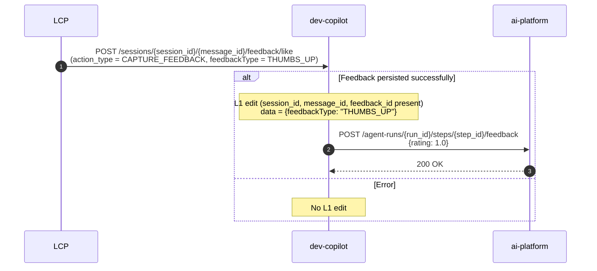
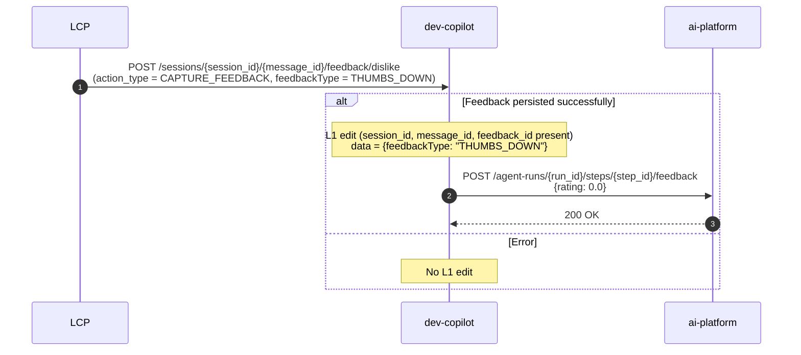
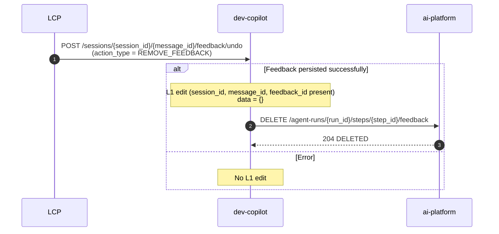

# Feature Specification: Feedback Capture on Agent Messages

**Created**: 2026-06-02  
**Status**: Draft
**Components**: developer-copilot (backend), composer-chat (frontend), ai-platform-agents (AIP)

## Overview

Enable users to submit thumbs-up/thumbs-down feedback on individual assistant messages in the Developer Copilot chat UI. Feedback is stored in AI Platform's tracing infrastructure (via the feedback store), scoped to individual steps within an agent run. On session reload, previously submitted feedback is displayed alongside the corresponding messages.

**Key Problem**: There is no mechanism to capture user satisfaction signals on individual LLM responses. This data is critical for evaluating agent quality, identifying failure patterns, and improving prompt engineering.

**Solution**: Wire the existing (but stub) `POST /sessions/{session_id}/feedback` endpoint to AIP's feedback endpoints, expose `run_id` and `step_id` in SSE envelopes so the UI can submit feedback per message, and enrich `GET /sessions/{session_id}/messages` to include feedback state.

## System Components

| Component | Responsibility |
|-----------|----------------|
| **composer-chat (UI)** | Render thumbs up/down buttons on assistant messages, submit feedback via API |
| **@appian/ui-library** | UnifiedChat component — may need `onFeedback` callback or already exposes one |
| **developer-copilot (backend)** | Route feedback to AIP, enrich GET /messages with feedback state |
| **AI Platform Agents API** | Store/retrieve feedback annotations per step within a run |
| **AI Platform Feedback Store** | Persistent storage (PostgreSQL `agent_feedback` table) |

## Architecture Diagram

### Sequence 1: Capture Positive Feedback (Like)



### Sequence 2: Capture Negative Feedback (Dislike)



### Sequence 3: Remove Feedback (Undo)



---

### L1 Edit for Feedback State

When feedback is successfully persisted/removed in AIP, the backend emits an **L1 `edit` event** on the SSE stream to update the UI state in real-time.

**How the L1 edit is pushed to the SSE stream:**

The router already has an in-memory pub/sub system (`_subscribers` dict of `asyncio.Queue` per session) used to coordinate `send_message` with `stream_events`. The feedback endpoint reuses this mechanism:

1. Feedback endpoint calls AIP and gets success
2. Formats the L1 edit SSE frame
3. Pushes the formatted frame directly into the subscriber queues for that session
4. The SSE generator (already blocking on `q.get()`) receives it and yields it to the client

The generator needs to distinguish between:

* `"init"` — trigger initial stream (existing)
* `"turn"` — new turn started, stream from AIP (existing)
* `("emit", sse_frame)` — yield this frame directly to the client (new)

This means all connected SSE clients for that session (including multiple tabs) receive the feedback update immediately.

**Capture feedback:**

```
event: edit
data: {"session_id":"abc-123","message_id":"msg_def456_2","type":"feedback","timestamp":"...","data":{"feedbackType":"THUMBS_UP"}}

```

**Remove feedback:**

```
event: edit
data: {"session_id":"abc-123","message_id":"msg_def456_2","type":"feedback","timestamp":"...","data":{}}

```

The UI receives this L1 edit and updates the thumbs button state on the corresponding message.

## Detailed Design

### 1. SSE Envelope Change — Expose `run_id` and `step_id`

Currently, the SSE frames sent to the UI contain `session_id` and `message_id` but NOT the AIP `run_id` or `step_id`. The UI needs these to submit feedback.

**Current envelope:**

```json
{
  "session_id": "abc-123",
  "message_id": "msg_def456_2",
  "type": "text_content",
  "timestamp": "2026-06-02T10:00:00Z",
  "data": {"role": "assistant", "content": "Here's your interface..."}
}

```

**Proposed envelope:**

```json
{
  "session_id": "abc-123",
  "message_id": "msg_def456_2",
  "run_id": "def-456-full-uuid",
  "step_id": "2.done",
  "type": "text_content",
  "timestamp": "2026-06-02T10:00:00Z",
  "data": {"role": "assistant", "content": "Here's your interface..."}
}

```

**Rules:**

* `run_id` and `step_id` are only included on events originating from AIP messages (not synthetic events like `stream_end`)
* `step_id` format follows AIP convention: `{index}.{type}` (e.g., `0.user-request`, `1.tool-use`, `2.done`)
* `run_id` is the full UUID of the AIP run (planning or execution) that produced the message

### 2. Frontend Changes — Thumbs Up/Down Buttons

**Location**: `service-components/composer-chat/src/modules/ComposerChat/`

**Where feedback buttons appear:**

TBD — to be decided which message types (text_content, task_plan, task_steps, suggestion, summary) get 👍/👎 buttons. See Open Questions #1.

**Interaction behavior:**

* Once feedback is submitted, visually indicate the selected state (filled icon)
* Clicking the same button again triggers `REMOVE_FEEDBACK` (toggle behavior)
* Clicking the opposite button triggers `REMOVE_FEEDBACK` + `CAPTURE_FEEDBACK` (switch)

**Data flow:**

1. UI receives SSE event with `run_id` + `step_id` in the envelope
2. UI stores `{message_id → {run_id, step_id}}` in component state
3. User clicks 👍 → UI calls `POST /sessions/{session_id}/feedback` with all identifiers
4. UI optimistically updates the button state (no waiting for 202)
5. On error, UI reverts the button state and shows a toast

**Persistence across reload:**

* Option A: Store feedback state in `localStorage` keyed by `session_id`
* Option B: Retrieve from `GET /sessions/{session_id}/messages` response (merged feedback)
* **Recommended: Both** — localStorage for instant display, GET /messages as source of truth

### 3. Backend Changes — `POST /sessions/{session_id}/{message_id}/feedback`

**Current state:** Stub endpoint at `/sessions/{session_id}/feedback` returning 202 with no logic.

**Proposed change:** Move feedback to per-message URLs matching specific interactions.

**Proposed request models:**

Note: `runId` and `stepId` are NOT in the request body. The backend resolves them from the `message_id` by looking up the message's `metadata.step_id` and determining which run it belongs to.

**CAPTURE_FEEDBACK flow (Like & Dislike):**

1. Resolve `run_id` and `step_id` from the `message_id`
2. Map `feedbackType` to AIP rating: `THUMBS_UP → 1.0`, `THUMBS_DOWN → 0.0`
3. Call AIP: `POST /agent-runs/{run_id}/steps/{step_id}/feedback` with `{rating}`
4. **On success:** Emit L1 `edit` event on SSE stream with `type: "feedback"`, `message_id`, and updated data envelope.
5. **On failure:** Do NOT emit L1 edit. Return error to caller.

**REMOVE_FEEDBACK flow (Undo):**

1. Resolve `run_id` and `step_id` from the `message_id`
2. Call AIP: `DELETE /agent-runs/{run_id}/steps/{step_id}/feedback`
3. **On success:** Emit L1 `edit` event on SSE stream with `type: "feedback"`, `message_id`, `data: {}`
4. **On failure:** Do NOT emit L1 edit. Return error to caller.

### 4. AI Platform Changes Required

**4a. Add `step_id` to `FeedbackItem` response model**

Currently `GET /agent-runs/{run_id}/feedback` returns `FeedbackItem` without `step_id`. The data IS stored in the `agent_feedback` table but not exposed in the response.

**Change in AIP `FeedbackItem` response model:**

Add `step_id` field (nullable string) to `FeedbackItem` so that `GET /agent-runs/{run_id}/feedback` returns which step each feedback belongs to. The data is already stored in the `agent_feedback` table — it just needs to be exposed in the response.

**Change in AIP `get_run_feedback` endpoint:**

Include `entity.step_id` when building the response list.

**4b. DELETE feedback endpoint**

Ensure AIP exposes `DELETE /agent-runs/{run_id}/steps/{step_id}/feedback` to explicitly remove step configurations and drop traces cleanly.

## step_id Format Reference

AIP assigns `step_id` to each message in a run:

| step_id | Meaning |
| --- | --- |
| `0.user-request` | Initial user message |
| `1.tool-use` | First tool call + result |
| `2.tool-use` | Second tool call + result |
| `3.done` | Final assistant text response |

Format: `{zero_based_index}.{step_type}`
Validated by: `^\d+\.\w[\w-]*$`

## Session Context — Planning vs Execution Runs

A session has at most two `run_id`s:

```
session_id = planning_run_id ("abc-123")
                └── execution_run_id ("def-456"), tagged: {planning_run_id: "abc-123"}

```

* Messages in the planning run have their own step_ids (0.user-request, 1.tool-use, ...)
* Messages in the execution run have independent step_ids (0.user-request, 1.tool-use, ...)
* The same step_id (e.g., `1.tool-use`) can exist in BOTH runs — `run_id` disambiguates

**Feedback is scoped to `(run_id, step_id)` — both are required.**

## Feedback Rating Mapping

| UI Action | AIP Rating | Target Endpoint |
| --- | --- | --- |
| 👍 Thumbs Up | `1.0` | `POST /agent-runs/{run_id}/steps/{step_id}/feedback` |
| 👎 Thumbs Down | `0.0` | `POST /agent-runs/{run_id}/steps/{step_id}/feedback` |
| Remove feedback | — | `DELETE /agent-runs/{run_id}/steps/{step_id}/feedback` |

## User Flows

### Flow 1: User submits positive feedback

1. User sees assistant message with 👍 👎 buttons
2. User clicks 👍
3. UI optimistically fills the 👍 icon
4. UI calls `POST /sessions/{session_id}/{message_id}/feedback/like` with `{action: CAPTURE_FEEDBACK, feedbackType: THUMBS_UP}`
5. Backend validates, calls AIP `POST /agent-runs/{runId}/steps/{stepId}/feedback` with `{rating: 1.0}`
6. AIP stores in `agent_feedback` table
7. Backend updates subscriber queue context and registers 200 OK

### Flow 2: User changes feedback from positive to negative

1. Message already shows filled 👍
2. User clicks 👎
3. UI triggers interaction sequence to establish `THUMBS_DOWN` state by navigating underlying mapping rules
4. UI calls `POST /sessions/{session_id}/{message_id}/feedback/dislike` with `{action: CAPTURE_FEEDBACK, feedbackType: THUMBS_DOWN}`
5. Backend invokes downstream updates to clear old tracks and assign `{rating: 0.0}`

### Flow 3: User removes feedback

1. Message shows filled 👍
2. User clicks 👍 again (toggle off)
3. UI sends tracking update to `POST /sessions/{session_id}/{message_id}/feedback/undo`
4. Backend calls AIP `DELETE` route to drop the active tracing row

## File Changes probably needed

| File | Change |
| --- | --- |
| `aip_sessions/sse_transform.py` | Add `aip_step_id` param to `format_sse_frame()`, include in envelope |
| `aip_sessions/router.py` | Pass `step_id` + `current_run` to `format_sse_frame()`; implement feedback endpoints |
| `orchestrators/aip/client.py` | Add `submit_step_feedback()` methods |
| `chat-api-oas.yaml` | Update FeedbackRequest routes, add `run_id`/`step_id` to SSE envelope |
| `composer-chat` UI | Feedback buttons on assistant messages, split endpoint submission paths |
| `ai-platform-agents` (external) | Add `step_id` to `FeedbackItem` response model |

```

```